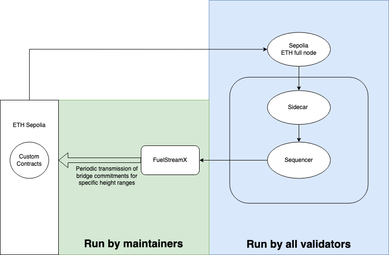

# seq-testnet-2

- [Network Details](#network-details)
- [Typical Setup](#typical-setup)
- [Run an Ethereum Sepolia Node](#run-an-ethereum-sepolia-node)
- [Run a Sequencer Node with Sidecar](#run-a-sequencer-node-with-sidecar)
  - [Joining Post-Genesis](#joining-post-genesis)
  - [What to Expect](#what-to-expect)
  - [Tendermint KMS](#tendermint-kms)
  - [Additional Advanced Configuration](#additional-advanced-configuration)
- [Monitoring](#monitoring)
  - [Sequencer](#sequencer)
  - [Sidecar](#sidecar)

## Network Details

- **Chain ID**: `seq-testnet-2`
- **Target launch date**: 2024-12-04
- **Current binary version**: `seq-testnet-2`
- **Launch binary version**: `seq-testnet-2`
- **Genesis file without gentxs**: included in this folder.
- **Genesis file with gentxs**: included in this folder.
- **Minimum gas price**: `10test`

Useful links:

- **Explorer**: https://fuel-seq.simplystaking.xyz/fuel-testnet
- **Public RPC**: https://testnet-rpc-fuel-seq.simplystaking.xyz
- **Public REST**: https://testnet-rest-fuel-seq.simplystaking.xyz
- **Public gRPC**: testnet-grpc-fuel-seq.simplystaking.xyz:443
- **API docs**: https://testnet-rest-fuel-seq.simplystaking.xyz/swagger/
- **Indexer**: http://testnet-indexer-fuel-seq.simplystaking.xyz

Indexer:

- `/seq/withdrawals?address=ADDRESS` ([example](http://testnet-indexer-fuel-seq.simplystaking.xyz/seq/withdrawals?address=0x0165878A594ca255338adfa4d48449f69242Eb8F))
- `/seq/withdrawals?address=ADDRESS&pending=true` ([example](http://testnet-indexer-fuel-seq.simplystaking.xyz/seq/withdrawals?address=0x0165878A594ca255338adfa4d48449f69242Eb8F&pending=true))
- `/seq/supply-deltas` ([example](http://testnet-indexer-fuel-seq.simplystaking.xyz/seq/supply-deltas))
- `/seq/supply-deltas?pending=true` ([example](http://testnet-indexer-fuel-seq.simplystaking.xyz/seq/supply-deltas?pending=true))
- `/seq/supply-deltas?pending=true&zeros=false` ([example](http://testnet-indexer-fuel-seq.simplystaking.xyz/seq/supply-deltas?pending=true&zeros=false))
- `/seq/proof?nonce=NONCE` ([example](http://testnet-indexer-fuel-seq.simplystaking.xyz/seq/proof?nonce=1))

Ethereum contracts ([ref](https://github.com/FuelLabs/fuel-rollup/tree/main/networks)):

- [0xd7Fc4e8FB2c05567C313f4C9b9e07641a361a550](https://sepolia.etherscan.io/address/0xd7Fc4e8FB2c05567C313f4C9b9e07641a361a550): TokenV2
- [0x9Cf47dDBebedB7f740417Bfd87efc7c3CD63Adec](https://sepolia.etherscan.io/address/0x9Cf47dDBebedB7f740417Bfd87efc7c3CD63Adec): TokenV1
- [0xDC337a28d62eC3295F896171FA82C39c2a8e7c0A](https://sepolia.etherscan.io/address/0xDC337a28d62eC3295F896171FA82C39c2a8e7c0A): Vault
- [0x0E5CAcD6899a1E2a4B4E6e0c8a1eA7feAD3E25eD](https://sepolia.etherscan.io/address/0x0E5CAcD6899a1E2a4B4E6e0c8a1eA7feAD3E25eD): SequencerProxy (sidecar listens to this)
- [0x742C478a1951257E83d3aC8f3DFB3A8e6AB9a2E4](https://sepolia.etherscan.io/address/0x742C478a1951257E83d3aC8f3DFB3A8e6AB9a2E4): SequencerInterface (users use this to deposit etc.)
- [0x41d047B393C12Db1a48766690C12134999228965](https://sepolia.etherscan.io/address/0x41d047B393C12Db1a48766690C12134999228965): TokenMigrator
- [0x7E2DB7DabaB2A8294292ecAde3F1328B2BDfc730](https://sepolia.etherscan.io/address/0x7E2DB7DabaB2A8294292ecAde3F1328B2BDfc730): Faucet 
- [0x130F143e0F6d87371ca510e11340C2F3cD407a2b](https://sepolia.etherscan.io/address/0x130F143e0F6d87371ca510e11340C2F3cD407a2b): FuelStreamX (bridge commitments and withdrawals/supplydelta)

Consensus addresses of genesis validators:

- `9DCE33C6EE90FA0FFED2BE46B30D0FF88D232DC6`: Simply Staking

FuelStreamX multi-sig:

- Safe address: [0xa54da230EcE2c8F341D8f0c9326ab6688978e039](https://sepolia.etherscan.io/address/0xa54da230EcE2c8F341D8f0c9326ab6688978e039)
- Comprised of:
  - [0x2B4ce813f1e814004c7B806bC31B4Fe0650C6FA8](https://sepolia.etherscan.io/address/0x2B4ce813f1e814004c7B806bC31B4Fe0650C6FA8) (Proposer)
  - [0xa2A997815de670F2dBb85Bc9443cA05A91F47508](https://sepolia.etherscan.io/address/0xa2A997815de670F2dBb85Bc9443cA05A91F47508) (Signer 1)
  - [0x9555cA07166C30Edb792707cEB10b5043F8B342e](https://sepolia.etherscan.io/address/0x9555cA07166C30Edb792707cEB10b5043F8B342e) (Signer 2)
  - [0xb099a7a92a7A6a75233847EC3eAFe3EC57Df2200](https://sepolia.etherscan.io/address/0xb099a7a92a7A6a75233847EC3eAFe3EC57Df2200) (Fuel DevOps Signer)
- Tx queue: https://app.safe.global/transactions/queue?safe=sep:0xa54da230EcE2c8F341D8f0c9326ab6688978e039

## Typical Setup



Each validator can:

- Get access to the binary (includes Sequencer and Sidecar).
- Get access to the Genesis file.
- Configure and run their sequencer validator using the binary.
- Configure and run the sidecar using the binary.

Configuration of the Sidecar requires specifying e.g. the Ethereum contract address that the Sidecar will monitor - this will be provided by the network maintainers.

Unless otherwise configured, at least the following ports should be available:

- **Sequencer**: 26656, 26657, 9090, 1317
- **Sidecar**: 8080
- **Ethereum**: 8545, 8546

These components communicate together, so any reconfiguration of the above ports likely needs to be reflected on the other respective component as well. Most notably:

- Changes to the **Sequencer ports** need to be reflected in the **Sidecar's runtime flags**.
- Changes to the **Sidecar port** need to be reflected in the **Sequencer's app config**.
- Changes to the **Ethereum ports** need to be reflected in the **Sidecar's runtime flags**.

## Run an Ethereum Sepolia Full Node

To ensure the highest performance and reliability of the Sequencer infrastructure, **running your own Ethereum Sepolia full node is a requirement**. Avoiding the use of third-party services for Ethereum node operations significantly helps the Sequencer network's liveness. Please note these recommended node configurations:

```
--syncmode=snap
--gcmode=full
```

## Run a Sequencer Node with Sidecar

> The minimum requirements for the **Sequencer** and **Sidecar** are:
> 
> - 4 core
> - 8 GB ram
> - 200GB disk space

> Based on material from:
> 
> - https://docs.cosmos.network/main/tooling/cosmovisor
> - https://docs.osmosis.zone/networks/join-mainnet/#set-up-cosmovisor

Obtain binary and genesis from this repository:

- Binary from release: https://github.com/FuelLabs/fuel-sequencer-deployments/releases
- Genesis from here: https://github.com/FuelLabs/fuel-sequencer-deployments/blob/main/seq-testnet-2/genesis.json

Download the right binary based on your architecture to `$GOPATH/bin/` with the name `fuelsequencerd`:

- `echo $GOPATH` to ensure it exists. If not, `go` might not be installed.
- `mkdir $GOPATH/bin/` if the directory does not exist.
- `curl <url/to/binary>` to download the binary.
- `cp <binary> $GOPATH/bin/fuelsequencerd`

Initialise node directory:

- `fuelsequencerd init <node-name> --chain-id seq-testnet-2`

Install and configure Cosmovisor:

- A pre-requisite is to have `go` installed. We recommend installing version `1.21+`.
- Install Cosmovisor: `go install cosmossdk.io/tools/cosmovisor/cmd/cosmovisor@latest`.
- Set environment variables:
    ```bash
    echo "# Setup Cosmovisor" >> ~/.profile
    echo "export DAEMON_NAME=fuelsequencerd" >> ~/.profile
    echo "export DAEMON_HOME=$HOME/.fuelsequencer" >> ~/.profile
    echo "export DAEMON_ALLOW_DOWNLOAD_BINARIES=true" >> ~/.profile
    echo "export DAEMON_LOG_BUFFER_SIZE=512" >> ~/.profile
    echo "export DAEMON_RESTART_AFTER_UPGRADE=true" >> ~/.profile
    echo "export UNSAFE_SKIP_BACKUP=true" >> ~/.profile
    echo "export DAEMON_SHUTDOWN_GRACE=15s" >> ~/.profile
  
    # Check https://docs.cosmos.network/main/tooling/cosmovisor for more configuration options.
    ```
- Apply environment variables: `source ~/.profile`.
- You can also repeat the above steps but for `~/.bashrc` instead of `~/.profile`.
- Initialise Cosmovisor directories: `cosmovisor init <path-to-fuelsequencerd-binary>` (hint: `whereis fuelsequencerd` for the path).

Configure the node (part 1: `~/.fuelsequencer/config/app.toml`):

- Set `minimum-gas-prices = "10test"`.
- Configure `[sidecar]`:
  - Ensure that `enabled = true`.
  - Ensure that `address` is where the Sidecar will run.
- Configure `[api]`:
  - Set `swagger=true` (optional).
  - Set `rpc-max-body-bytes = 1153434` (optional - relevant for public REST).
- Configure `[commitments]`:
  - Set `api-enabled = true` (optional - relevant for public REST).
- Configure `[state-sync]`:
  - Set `snapshot-interval = 1000` (optional - to provide state-sync service).
- Configure:
  - Set `rpc-read-timeout = 10` (optional - relevant for public REST).
  - Set `rpc-write-timeout = 0` (optional - relevant for public REST).

**WARNING**: leaving the `[commitments]` API accessible to anyone can lead to DoS! It is highly recommended to handle whitelisting or authentication by a reverse proxy like [Traefik](https://traefik.io/traefik/) for gRPC if the commitments API is enabled.

Configure the node (part 2: `~/.fuelsequencer/config/config.toml`):

- Configure `[p2p]`:
  - Set `persistent_peers = "3a0b4118c01addd33d5add81783805d5add2fb17@80.64.208.17:26656"`.
- Configure `[mempool]`:
  - Set `max_tx_bytes = 1153434` (1.1MiB) - Note: this fits the largest possible transaction.
  - Set `max_txs_bytes = 23068670` (~22MiB) - Note: this is at most 10x the max block bytes.
- Configure `[rpc]`:
  - Set `max_body_bytes = 1153434` (optional - relevant for public RPC).

> Note: Ensuring consistent CometBFT mempool parameters across all network nodes is important to reduce transaction delays. This includes `mempool.size`, `mempool.max_txs_bytes`, and `mempool.max_tx_bytes` in [config.toml](https://docs.cometbft.com/v0.38/core/configuration) and `minimum-gas-prices` in [app.toml](https://docs.cosmos.network/main/learn/advanced/config).

If it's pre-genesis, and you want to be a genesis validator, submit the gentx to this repository:

- Move `genesis-no-gentxs.json` file to `~/.fuelsequencer/config/genesis.json`.
- `fuelsequencerd genesis gentx <KEY> 1000000000test --chain-id seq-testnet-2 --commission-rate 0.05`
- Submit the resultant `.json` file to this repository via a PR to the `gentxs/` folder.

**Once the genesis file is finalised by the network maintainers, this should be copied to `~/.fuelsequencer/config/genesis.json`**. 

At this point `cosmovisor run` will be the equivalent of running `fuelsequencerd`. In fact, to run the node you can use `cosmovisor run start`. **It is highly recommended to run the Sequencer and Sidecar as services**, so that they can run in the background. You will need to replicate the environment variables defined above.

Here's an example service file with some placeholder (`<...>`) values for the **Sequencer**:

```bash
[Unit]
Description=FuelSequencer Validator
After=network.target

[Service]
Type=simple
User=<USER>
ExecStart=<HOME>/go/bin/cosmovisor run start --home <NODE-HOME>
Restart=on-failure
RestartSec=3
LimitNOFILE=4096

Environment="DAEMON_NAME=fuelsequencerd"
Environment="DAEMON_HOME=/home/<USER>/.fuelsequencer"  # Double-check this!
Environment="DAEMON_ALLOW_DOWNLOAD_BINARIES=true"
Environment="DAEMON_LOG_BUFFER_SIZE=512"
Environment="DAEMON_RESTART_AFTER_UPGRADE=true"
Environment="UNSAFE_SKIP_BACKUP=true"
Environment="DAEMON_SHUTDOWN_GRACE=15s"

[Install]
WantedBy=multi-user.target
```

Here's an example service file with some placeholder (`<...>`) values for the **Sidecar**:

```bash
[Unit]
Description=FuelSequencer Sidecar
After=network.target

[Service]
Type=simple
User=<USER>
ExecStart=<HOME>/go/bin/fuelsequencerd start-sidecar \
    --host "0.0.0.0" \
    --sequencer_grpc_url "127.0.0.1:9090" \
    --eth_ws_url "<ETHEREUM_NODE_WS>" \
    --eth_rpc_url "<ETHEREUM_NODE_RPC>" \
    --eth_contract_address "0x0E5CAcD6899a1E2a4B4E6e0c8a1eA7feAD3E25eD"
Restart=on-failure
RestartSec=3
LimitNOFILE=4096

[Install]
WantedBy=multi-user.target
```

Each validator in the Sequencer network must be connected to a Sidecar. Non-validator nodes, on the other hand, do not need to be connected to a Sidecar.

It is specifically very important to ensure that you provide all the necessary flags when running the Sidecar to ensure that it can connect to an Ethereum node and to the Sequencer node, and is also accessible by the Sequencer node. The most important flags are:

- `host`: host for the gRPC server to listen on
- `port`: port for the gRPC server to listen on
- `eth_ws_url`: Ethereum node WebSocket endpoint
- `eth_rpc_url`: Ethereum node RPC endpoint
- `eth_contract_address`: address in hex format of the contract to monitor for logs
- `sequencer_grpc_url`: Sequencer node gRPC endpoint

### Joining Post-Genesis

> Note: you can have a look at the option of using State Sync to get synced up faster: https://fuel-seq.simplystaking.xyz/fuel-testnet/statesync

Assumptions:

1. You are already running a full Sequencer node with a Sidecar, by following the above instructions.
2. The account being used to create your validator has at least 1FUEL, with enough extra to pay for gas.

To create the validator, run:

```sh
fuel-sequencerd tx staking create-validator path/to/validator.json \
    --from keyname \
    --gas auto \
    --gas-prices 10fuel \
    --gas-adjustment 1.5 \
    --chain-id seq-testnet-2
```

...where validator.json contains:

```json
{
	"pubkey": {"@type":"/cosmos.crypto.ed25519.PubKey","key":"<PUBKEY>"},
	"amount": "1000000000fuel",
	"moniker": "<MONIKER>",
	"identity": "<OPTIONAL-IDENTITY>",
	"website": "<OPTIONAL-WEBSITE>",
	"security": "<OPTIONAL-EMAIL>",
	"details": "<OPTIONAL-DETAILS>",
	"commission-rate": "0.05",
	"commission-max-rate": "<MAX-RATE>",
	"commission-max-change-rate": "<MAX-CHANGE-RATE>",
	"min-self-delegation": "1"
}
```

...where the pubkey can be obtained using `fuelsequencerd tendermint show-validator`.

### What to Expect

If the genesis time is in the future, the Sequencer will show:

```
Genesis time is in the future. Sleeping until then... genTime=YYYY-MM-DDThh:mm:ssZ module=server
```

In the same situation, the Sidecar will show:

```
did not find a start block, but maybe Sequencer hasn't started; ensure Sequencer is available at <IP:PORT>
```

If the genesis time is in the past, then the Sequencer should show block generation, and the Sidecar should show block extraction.

### Tendermint KMS

If you will be using `tmkms`, make sure that in the config:

- Chain ID is set to `seq-testnet-2` wherever applicable
- `account_key_prefix = "fuelsequencerpub"`
- `consensus_key_prefix = "fuelsequencervalconspub"`
- `sign_extensions = true`
- `protocol_version = "v0.34"`

### Additional Advanced Configuration

Sidecar flags:

- `development`: starts the sidecar in development mode
- `eth_max_block_range`: max number of Ethereum blocks queried at one go
- `eth_min_logs_query_interval`: minimum wait between successive queries for logs
- `unsafe_eth_start_block`: the Ethereum block to start querying from
- `unsafe_eth_end_block`: the last Ethereum block to query. Incorrect use can cause the validator to propose empty blocks, leading to slashing!
- `sequencer_path_to_cert_file`: path to the certificate file of the Sequencer infrastructure for secure communication. Specify this value if the Sequencer infrastructure was set up using TLS.
- `sidecar_path_to_cert_file`: path to the certificate file of the sidecar server for secure communication. Specify this value if you want to set up a sidecar server with TLS.
- `sidecar_path_to_key_file`: path to the private key file of the sidecar server for secure communication. Specify this value if you want to set up a sidecar server with TLS.
- `prometheus_enabled`: enables serving of prometheus metrics
- `prometheus_listen_address`: address to listen for prometheus collectors (default ":8081")
- `prometheus_max_open_connections`: max number of simultaneous connections (default 3)
- `prometheus_namespace`: instrumentation namespace (default "sidecar")
- `prometheus_read_header_timeout`: amount of time allowed to read request headers (default 10s)
- `prometheus_write_timeout`: maximum duration before timing out writes of the response (default 10s)

Sidecar client flags:

- `sidecar_grpc_url`: the sidecar's gRPC endpoint
- `query_timeout`: how long to wait before the request times out

## Monitoring

Both the Sequencer and the Sidecar come with a set of metrics that can be exposed via Prometheus out-of-the-box.

### Sequencer

To enable prometheus metrics on the Sequencer set the following in your configurations:

- config.toml (default: `~/.fuelsequencer/config/config.toml`) -> `instrumentation` -> `prometheus` -> `true`
- config.toml (default: `~/.fuelsequencer/config/config.toml`) -> `instrumentation` -> `prometheus_listen_addr` -> `":26660"`
- app.toml (default: `~/.fuelsequencer/config/app.toml`) -> `telemetry` -> `enabled` -> `true`
- app.toml (default: `~/.fuelsequencer/config/app.toml`) -> `telemetry` -> `prometheus-retention-time` -> `"3600"`

> The `prometheus-retention-time` determines how long the node retains stale values before they get removed from the metrics list until the value gets updated again.

The enabled metrics will show up at `http://<HOST>:26660`.

These are the list of metrics enabled on the Sequencer:

- `sequencer_begin_block_minted_tokens`
- `sequencer_begin_block_supply_current`
- `sequencer_begin_block_supply_last`
- `sequencer_begin_block_supply_offset`
- `sequencer_store_ethereum_event_index_offset`
- `sequencer_store_last_ethereum_nonce`
- `sequencer_store_index_num_injected_txs_total`
- `sequencer_store_last_consensus_txs_sequence`
- `sequencer_ante_handler_injected_msg`
- `sequencer_tx_msg_deposit_from_ethereum`
- `sequencer_tx_msg_withdraw_to_ethereum`
- `sequencer_store_time_since_last_eth_update`

> Note: The metrics above were not described in detail because Sequencer metrics are primarily intended for the Sequencer maintainers.

### Sidecar

To enable Prometheus metrics on the Sidecar, run the Sidecar startup command with the following flags as parameters:

- `--prometheus-enabled true`
- (Optional) `--prometheus_listen_address ":8081"`

The enabled metrics will show up at `http://<HOST>:8081`

These are the list of metrics enabled on the Sidecar:

- `sidecar_core_max_syncable_block`: the last Ethereum block that the Sidecar can sync at the moment.
- `sidecar_core_last_header_seen`: the most recent Ethereum header that the Sidecar detected.
  - If this stops increasing then the Sidecar does not know about new Ethereum headers.
- `sidecar_core_header_delay_seconds_bucket`: delays in receiving Ethereum headers.
  - If this is too high, your Sidecar is taking too long to sync to Ethereum.
- `sidecar_core_start_time`: the time that the Sidecar started as a Unix timestamp in seconds.
  - If this resets this means the Sidecar restarted.
- `sidecar_core_catching_up`: whether the sidecar is catching up to Ethereum. 1 if yes, 0 if no.
- `sidecar_eth_logs_query_delay_seconds_bucket`: how long it takes to receive queried Ethereum logs.
- `sidecar_eth_logs_query_error_count`: how many errors were observed when querying Ethereum logs
- `sidecar_seq_lebs_query_delay_seconds_bucket`: how long it takes to receive queried LastEthereumBlockSynced.
- `sidecar_seq_lebs_query_error_count`: how many errors were observed when querying the LastEthereumBlockSynced.
- `sidecar_store_events_processed`: the number of events processed by the Sidecar.
- `sidecar_store_blocks_pruned`: the number of old Ethereum blocks pruned by the Sidecar.
- `sidecar_store_start_query_block`: the oldest Ethereum block that the Sidecar has in state, if any.
- `sidecar_store_last_synced_block`: the last Ethereum block synced by the Sidecar.
  - If this stops increasing even as new Ethereum blocks are finalised, something is wrong.
  - Note that LastSyncedBlock increases in a staggered manner since the Sidecar needs to wait for a block to be finalised before syncing it.
- `sidecar_service_block_events_requests_total`: how many requests for block events the Sidecar received, with success status.
  - If this is not increasing at every Sequencer block, then the validator is not successfully querying the Sidecar.
  - Note that this metric also reports erroneous requests, which are typically not problematic. The problem would be if it is not increasing at all.

> Note: Node operators should become familiar with the Sidecar metrics as it is the responsibility of the operators to ensure that the Sidecar is functioning correctly.
