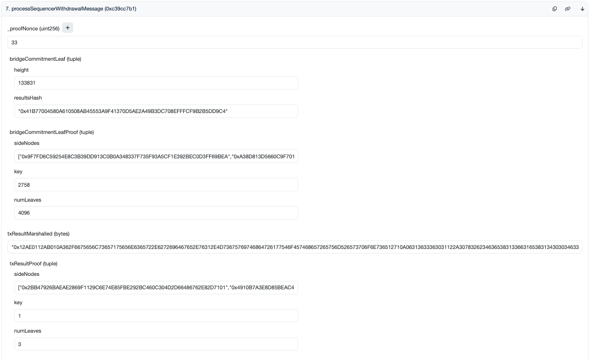

# Withdraw from the Sequencer Testnet

Check balance:

```sh
fuelsequencerd q bank balances $(fuelsequencerd keys show <KEY> -a) --node https://testnet-rpc-fuel-seq.simplystaking.xyz
# or
fuelsequencerd q bank balances <ADDRESS> --node https://testnet-rpc-fuel-seq.simplystaking.xyz
```

Initiate a withdrawal, making sure to fill in the placeholder `<...>` values:

```sh
fuelsequencerd tx bridge withdraw-to-ethereum <ETHEREUM-ADDRESS> <AMOUNT>test \
        --from <KEY> \
        --gas auto \
        --gas-adjustment 1.5 \
        --gas-prices 10test \
        --chain-id seq-testnet-2 \
        --node https://testnet-rpc-fuel-seq.simplystaking.xyz \
        -y
```

Ensure that the withdrawal passed by checking the explorer:

- https://fuel-seq.simplystaking.xyz/fuel-testnet/tx/<TX-HASH>

> **At this point you will need to wait at least 8 hours for the withdrawal to be processable on Ethereum!**

After waiting for 8 hours, check that `IsProvable` is true, making sure to fill in the placeholder value:

- `https://testnet-indexer-fuel-seq.simplystaking.xyz/seq/withdrawals?address=<ETHEREUM-ADDRESS>&pending=true`

Example result:

```json
{
  "Withdraws": [
    {
      "TxHash": "8EFB244D0F0435BDB0171BDC94DCD07CC5F4D7AEDC34A090A58878E1FAE01754",
      "Nonce": "163601",
      "FromAddress": "0x2b4ce813f1e814004c7b806bc31b4fe0650c6fa8",
      "Denom": "fuel",
      "Amount": "1000000",
      "IsProvable": true
    },
    // ...
  ]
}
```

Grab the nonce from the previous result (`163601` in this example) and get the proof for it:

- `https://testnet-indexer-fuel-seq.simplystaking.xyz/seq/proof?nonce=<NONCE>`

Example result:

```json
{
  "proof": {
    "bridge_commitment_leaf": {
      "height": 133831,
      "last_results_hash": "41B77004580A610508AB45553A9F41370D5AE2A49B3DC708EFFFCF9B2B5DD9C4"
    },
    "bridge_commitment_proof": {
      "total": 4096,
      "index": 2758,
      "leaf_hash": "CA200E9F5F0384F7193DE4D219F87815D02B689D97D622AA5922CF2E9BD4E389",
      "aunts": [
        "9F7FD6C59254E8C3B39DD913C0B0A348337F735F93A5CF1E392BEC0D3FF69BEA",
        "A38D813D5660C9F701EC9D01CC7BD7D454DB0E3265B1B9F6A3FCF2821DBC217E",
        "254BA198B5B65FBBC66EFE55924C284E076CC1A2986D3C8891C81091F74E45A1",
        "13606CF2F7210675B01A875141485B99A7530665134344FBFB7046AFFB04D579",
        "3240D22A0B402C44A28AFFCBC40C6A6800D0EEB0650812688FD7CDC76D595050",
        "844FF82B9CFC4CB4AFFD59A10E42724244C7959708D6AF4E11F4C79B9EBABE91",
        "E69692CD8AEBBD80B5E4686AFF354BC09F0AB29EA8BFE1526772E7D5824A9D66",
        "5174D0C9694EF2124F29E3C7F045FF2D13D5B97C9640F7D48D9AC9B99B9C2FB8",
        "9B01E582EF991D9136CA7A4413A2A30697E0986247139277E6C2D85B423505B8",
        "A635679F20FABD41456C1317BDDF0A7344E5A16E47F295E9CE815029103F3F81",
        "3A17C9FF45DDA21204DFBE90BC6BF4890878A37F4C81A48BA27D4D7DA7AC734A",
        "5E8874C567CE176D571AA752502877286D13A4831D14670B669C78E7313BD77E"
      ]
    },
    "tx_result_marshalled": "12AE0112AB010A362F6675656C73657175656E6365722E6272696467652E76312E4D73675769746864726177546F457468657265756D526573706F6E736512710A06313633363031122A3078326234636538313366316538313430303463376238303662633331623466653036353063366661381A2A307832623463653831336631653831343030346337623830366263333162346665303635306336666138220F0A047465737412073130303030303028FFFFFFFFFFFFFFFFFF013080C902",
    "last_results_proof": {
      "total": 3,
      "index": 1,
      "leaf_hash": "8550A7D3776565CECCC6B747D7E40820654488DA0CADCB55B5E229589FD82343",
      "aunts": [
        "2BB47926BAEAE2869F1129C6E74E85FBE292BC460C304D2D66486762E82D7101",
        "4910B7A3E8D85BEAC4DBD76883A21FC9A3B8E1744305A1516D43A508C2FF8A7D"
      ]
    }
  },
  "bridge_commitment_proof_nonce": 33,
  "source": "database"
}
```

Go to the FuelStreamX contract and connect your wallet:

- https://sepolia.etherscan.io/address/0x130F143e0F6d87371ca510e11340C2F3cD407a2b#writeProxyContract
- 

Fill-in the `processSequencerWithdrawalMessage` fields using the previous result as follows:

| Field on Etherscan                    | Where to get it from                                              | Example based on the above example result                                    |
|---------------------------------------|-------------------------------------------------------------------|------------------------------------------------------------------------------|
| `_proofNonce`                         | `bridge_commitment_proof_nonce`                                   | 33                                                                           |
| `bridgeCommitmentLeaf.height`         | `proof.bridge_commitment_leaf.height`                             | 133831                                                                       |
| `bridgeCommitmentLeaf.resultsHash`    | `proof.bridge_commitment_leaf.last_results_hash` with `0x` prefix | `"0x41B77004580A610508AB45553A9F41370D5AE2A49B3DC708EFFFCF9B2B5DD9C4"`       |
| `bridgeCommitmentLeafProof.sideNodes` | `proof.bridge_commitment_proof.aunts`, all with `0x` prefixes     | `["0x41B77004580A610508AB45553A9F41370D5AE2A49B3DC708EFFFCF9B2B5DD9C4",...]` |
| `bridgeCommitmentLeafProof.key`       | `proof.bridge_commitment_proof.index`                             | 2758                                                                         |
| `bridgeCommitmentLeafProof.numLeaves` | `proof.bridge_commitment_proof.total`                             | 4096                                                                         |
| `txResultMarshalled`                  | `proof.tx_result_marshalled` with `0x` prefix                     | `"0x12AE0112AB010A362F6675656C73657175656E..."`                              |
| `txResultProof.sideNodes`             | `proof.last_results_proof.aunts`, all with `0x` prefixes          | `["0x2BB47926BAEAE2869F1129C6E74E85FBE292BC460C304D2D66486762E82D7101",...]` |
| `txResultProof.key`                   | `proof.last_results_proof.index`                                  | 1                                                                            |
| `txResultProof.numLeaves`             | `proof.last_results_proof.total`                                  | 3                                                                            |

Here's a screenshot with the above values filled-in for reference:


